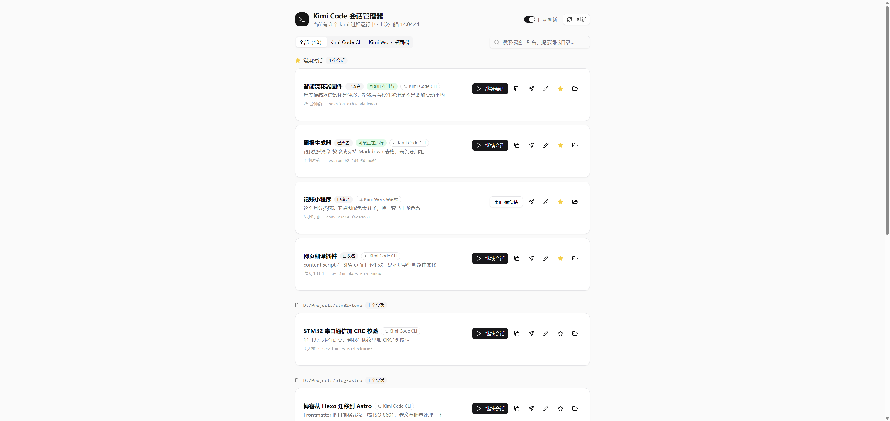
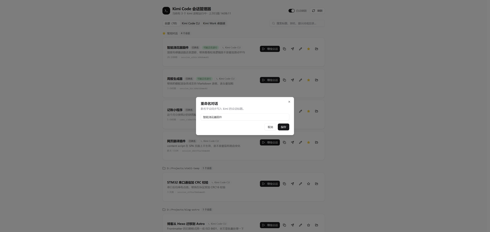
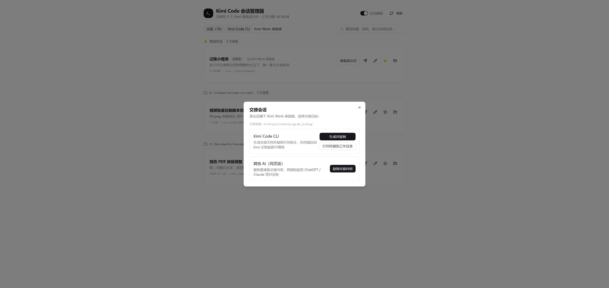
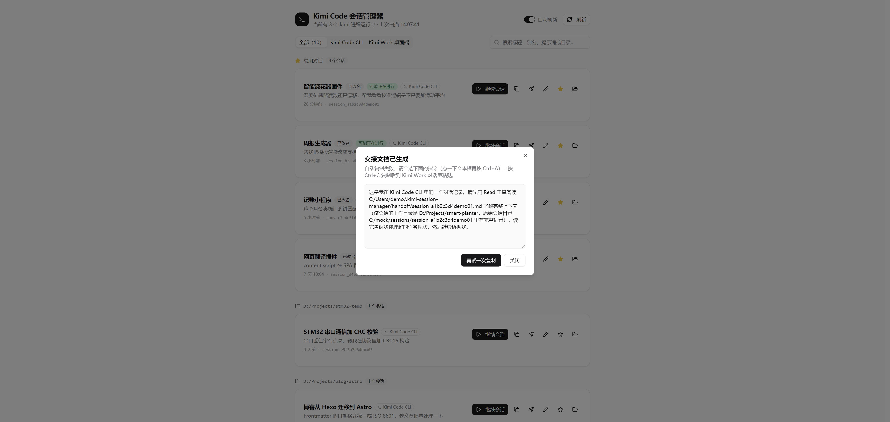

# Kimi Code 会话管理器（kimi-session-manager）

> A local companion tool for Kimi Code CLI: find all your sessions, resume any of them in one click, rename & favorite, and hand a conversation off to another AI.
>
> 一个运行在本地的小工具：列出你电脑上所有 Kimi Code CLI 会话，一键恢复、重命名、星标收藏，还能把对话「交接」给 Kimi Work 或其他 AI 继续。

**[中文说明](#中文说明) · [English README](#english-readme)**

---

## 中文说明

### 为什么做这个

用 Kimi Code CLI（终端版）同时开三四个会话干活时，总会遇到这些烦心事：

- 会话一多就分不清谁是谁，想回到某个对话只能凭记忆翻目录
- 关机 / 关掉终端后，想续上之前的对话要手动找 sessionId、敲 `kimi -S <id>`
- 有时候想把 CLI 里聊到一半的活交给 Kimi Work（桌面端，能读文件）继续，上下文却要重新讲一遍

这个工具就是为解决这些问题写的：打开一个网页，所有会话一目了然，点一下就回到对话里。

### 功能

| 截图 | 说明 |
| --- | --- |
|  | **主界面**：会话按项目目录分组，星标收藏自动置顶，"可能正在进行"徽标标记 6 小时内活跃的会话 |
|  | **重命名对话**：新标题会同步写回 kimi 的 state.json（`isCustomTitle` 置为 true），kimi 不会再自动改它 |
|  | **双向交接**：桌面端会话可一键交接到 Kimi Code CLI 或其他网页 AI |
|  | **复制兜底**：剪贴板被浏览器拒绝时，弹出手动复制对话框，功能不掉链子 |

- **中英双语界面**：标题栏一键切换 中文 / EN，选择会记住（localStorage），默认中文
- **会话扫描**：同时列出 Kimi Code CLI 和 Kimi Work 桌面端的全部本地会话，按工作目录分组、可搜索、15 秒自动刷新，并显示当前运行中的 kimi 进程数
- **一键恢复**：点「继续会话」自动在该会话的工作目录打开新终端并运行 `kimi -S <会话ID>`，和你手动敲命令完全等价；也可以一键复制命令或打开目录
- **重命名 + 收藏**：改名写回 kimi 的 state.json；收藏/别名持久化在本地，星标会话置顶显示
- **双向交接**：
  - CLI 会话 → Kimi Work：导出完整对话为 Markdown 交接文档（解析 wire.jsonl，跳过 systemPrompt 和思考过程，工具调用压缩为单行摘要），并复制一段引导指令，粘贴给 Kimi Work 即可接着干
  - 桌面端会话 → Kimi Code CLI：同样的交接文档 + 面向 Kimi Code 的指令，还能一键打开终端到工作目录
  - 任意会话 → 其他网页 AI：紧凑版交接内容（最近约 15 条消息，≤30KB），直接粘贴到 ChatGPT / Claude 等对话框
- **交接快照**：交接文档统一保存在 `~/.kimi-session-manager/handoff/`，本身就是一份按会话归档的对话备份，定期导出即是快照

### 快速开始

#### 方式一：单文件 exe（推荐给大多数人）

从 [Releases](https://github.com/3l3a3b/kimi-session-manager/releases) 下载 `kimi-session-manager.exe`，**双击即用**——不需要安装 Node.js 或任何依赖，会自动打开浏览器。

- 首次运行 Windows SmartScreen / 杀毒软件可能提示"未知发布者"（exe 没有购买代码签名证书，属正常现象），选择"仍要运行"即可
- 默认端口 7100，被占用时自动顺延，以控制台窗口打印的地址为准
- 关闭黑色控制台窗口（或按 Ctrl+C）即停止

#### 方式二：Node.js 独立服务器（免安装依赖）

有 Node.js 18+ 的话，下载分享包 `kimi-session-manager-share.zip`，解压后双击 `启动.bat`，或：

```bash
node server.mjs --port 7100
```

服务器只用 Node 内置模块，无需 `npm install`。

#### 方式三：开发者

```bash
git clone https://github.com/3l3a3b/kimi-session-manager.git
cd kimi-session-manager
npm install
npm run dev        # 开发模式（Vite，API 走 dev-server 中间件）

npm run build      # 构建前端到 dist/
npm start          # 零依赖独立服务器（standalone/server.mjs）
npm run build:exe  # 打包单文件 exe（Node SEA，产物在 build/）
```

### 数据与隐私

- 工具**只读取**本机 `~/.kimi-code` 与 Kimi 桌面端数据目录里的会话索引和对话记录，**没有任何网络上传**，全部在本机运行
- 「重命名」会把新标题写回该会话的 `state.json`（并将 `isCustomTitle` 置为 true）
- 收藏星标和别名保存在 `~/.kimi-session-manager/session-meta.json`；交接文档保存在 `~/.kimi-session-manager/handoff/`；界面语言选择保存在浏览器 localStorage
- 「继续会话」只是帮你在新终端里执行 `kimi -S <会话ID>`

### 技术栈

- 前端：React 19 + TypeScript + Vite + Tailwind CSS + shadcn/ui，自研轻量 i18n（中英字典 + Context）
- 后端：零依赖 Node 服务器（只用内置模块），开发期作为 Vite 中间件，发布期为独立 `server.mjs`
- 打包：Node SEA（Single Executable Applications）+ esbuild + postject，产出单文件 exe

### 目录结构

```
kimi-session-manager/
├── src/                  # React 前端
│   ├── i18n.tsx          # 中英双语字典 + 语言切换
│   └── pages/Home.tsx    # 主界面
├── server/api.ts         # 开发期 API（Vite 中间件）
├── standalone/server.mjs # 零依赖独立服务器（分享包 / npm start）
├── scripts/build-exe.mjs # Node SEA 打包脚本
├── docs/screenshots/     # README 配图
└── dist/                 # 前端构建产物（npm run build 生成）
```

### 免责声明

本项目是第三方爱好者工具，与月之暗面（Moonshot AI）官方无关。"Kimi" 相关商标权利归其所有者。使用前请自行判断，作者不对使用本工具造成的任何损失负责。

---

## English README

### Why this exists

When you run three or four Kimi Code CLI sessions in parallel, a few things get annoying fast:

- With that many sessions you can't tell them apart; getting back to a specific conversation means digging through opaque directories
- After a reboot or closing the terminal, resuming means hunting down the sessionId and typing `kimi -S <id>` by hand
- Sometimes you want to hand a half-finished CLI conversation to Kimi Work (the desktop app, which can read files), but you'd have to re-explain the whole context

This tool fixes all of that: open one page, see every session at a glance, click once to jump back in.

### Features

- **Bilingual UI**: one-click 中文 / EN switch in the header, remembered via localStorage (Chinese by default)
- **Session scanning**: lists all local sessions from both Kimi Code CLI and the Kimi Work desktop app, grouped by working directory, searchable, auto-refreshing every 15s, with a live count of running kimi processes
- **One-click resume**: "Resume" opens a new terminal in the session's working directory and runs `kimi -S <sessionId>` — exactly what you'd type by hand. You can also copy the command or open the folder
- **Rename & pin**: renaming writes back to kimi's `state.json` (setting `isCustomTitle: true`); pins and aliases persist locally, pinned sessions float to the top
- **Two-way handoff**:
  - CLI session → Kimi Work: exports the full conversation as a Markdown handoff document (parses wire.jsonl, skips the system prompt and thinking traces, compresses tool calls into one-line summaries) and copies a ready-to-paste instruction
  - Desktop session → Kimi Code CLI: same document plus a Kimi Code-oriented instruction, with a one-click "open terminal in working directory" button
  - Any session → other web AIs: a compact handoff (last ~15 messages, ≤30KB) you can paste straight into ChatGPT / Claude
- **Handoff snapshots**: handoff documents are kept in `~/.kimi-session-manager/handoff/`, doubling as a per-session archive of your conversations

### Quick start

#### Option 1: single-file exe (recommended)

Download `kimi-session-manager.exe` from [Releases](https://github.com/3l3a3b/kimi-session-manager/releases) and **double-click** — no Node.js or any other dependency required. Your browser opens automatically.

- Windows SmartScreen / antivirus may warn about an "unknown publisher" on first run (the exe is not code-signed — normal for hobby tools). Choose "Run anyway"
- Default port is 7100; if occupied it auto-increments — check the console window for the actual address
- Close the console window (or press Ctrl+C) to stop

#### Option 2: zero-dependency Node server

With Node.js 18+, download `kimi-session-manager-share.zip`, unzip and double-click `启动.bat`, or:

```bash
node server.mjs --port 7100
```

The server uses only Node built-in modules — no `npm install` needed.

#### Option 3: developers

```bash
git clone https://github.com/3l3a3b/kimi-session-manager.git
cd kimi-session-manager
npm install
npm run dev        # dev mode (Vite, API as dev-server middleware)

npm run build      # build the frontend into dist/
npm start          # zero-dependency standalone server (standalone/server.mjs)
npm run build:exe  # build the single-file exe (Node SEA, output in build/)
```

### Data & privacy

- The tool **only reads** session indexes and conversation records from your local `~/.kimi-code` and Kimi desktop data directories. **Nothing is uploaded** — everything runs on your machine
- "Rename" writes the new title back to the session's `state.json` (and sets `isCustomTitle: true`)
- Pins and aliases live in `~/.kimi-session-manager/session-meta.json`; handoff documents in `~/.kimi-session-manager/handoff/`; UI language preference in browser localStorage
- "Resume" simply runs `kimi -S <sessionId>` in a new terminal for you

### Tech stack

- Frontend: React 19 + TypeScript + Vite + Tailwind CSS + shadcn/ui, lightweight hand-rolled i18n (zh/en dictionary + Context)
- Backend: zero-dependency Node server (built-in modules only) — Vite middleware in dev, standalone `server.mjs` in release
- Packaging: Node SEA (Single Executable Applications) + esbuild + postject → single-file exe

### Disclaimer

This is a third-party hobby tool and is not affiliated with Moonshot AI. All "Kimi" trademarks belong to their owners. Use at your own risk; the author assumes no liability for any loss caused by using this tool.

## License

[MIT](LICENSE) © 2026 Leaphr
